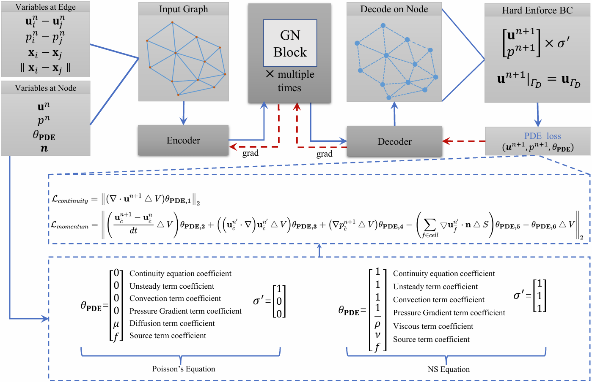
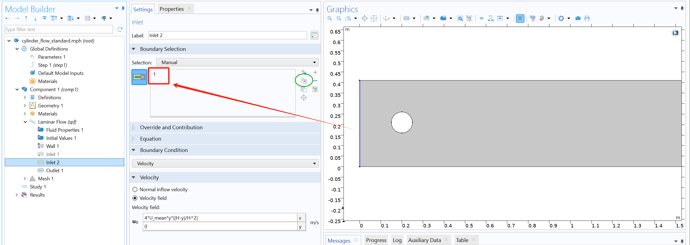

# Learning to Solve PDEs with Finite Volume-Informed Neural Networks in a Data-Free Approach
Partial differential equations (PDEs) play a crucial role in scientific computing. 
Recent advancements in deep learning have led to the development of both data-driven and and Physics-Informed Neural Networks (PINNs) for efficiently solving PDEs, though challenges remain in data acquisition and generalization for both approaches.
This paper presents a computational framework that combines the Finite Volume Method (FVM) with Graph Neural Networks (GNNs) to construct the PDE-loss, enabling direct parametric PDE solving during training without the need for precomputed data.
By exploiting GNNs' flexibility on unstructured grids, 
this framework extends its applicability across various geometries, physical equations and boundary conditions. 
The core innovation lies in an unsupervised training algorithm that utilizes GPU parallel computing to create a fully differentiable finite volume discretization process, 
such as gradient reconstruction and surface integration.
Our results demonstrate that the trained GNN model can efficiently solve multiple PDEs with varying boundary conditions and source terms in a single training session, 
with the number of iterations required to reach a steady-state solution being only 25\% of that required by traditional second-order CFD solvers.
[[arxiv](https://arxiv.org/pdf/2405.04466)]
<p align="center"><p align="left">
  
</p>

# TODO List

- [ ] GreenGauss Gradient (node-based and cell-based)
- [ ] Export to Tecplot dat file with surface zone
- [ ] Check if all grids are usable
- [ ] Fix LBFGS training bugs

# Catalog

- [Learning to Solve PDEs with Finite Volume-Informed Neural Networks in a Data-Free Approach](#learning-to-solve-pdes-with-finite-volume-informed-neural-networks-in-a-data-free-approach)
- [TODO List](#todo-list)
- [Catalog](#catalog)
- [Installation of the Code Environment](#installation-of-the-code-environment)
- [How To Use](#how-to-use)
  - [Mesh Generation and Data Structure](#mesh-generation-and-data-structure)
  - [Pre-Train](#pre-train)
  - [Inference Without Adam](#inference-without-adam)
  - [Inference With Adam (PINN-Style)](#inference-with-adam-pinn-style)
- [Code Directory and File Structure](#code-directory-and-file-structure)
    - [Top-level Files](#top-level-files)
    - [Example Code Files](#example-code-files)
    - [Instructions for Mesh dir](#instructions-for-mesh-dir)
    - [Explanation of the BC.json File](#explanation-of-the-bcjson-file)
  - [Explanation of Parameter Validity](#explanation-of-parameter-validity)
  - [Common Issue](#common-issue)
    - [Loss Calculation Produces NaN](#loss-calculation-produces-nan)

# Installation of the Code Environment
**pytorch-2.3.0**
```bash
conda create -n FVGN-pt2.3 python==3.11 # Create a new conda environment and specify the Python version
conda activate FVGN-pt2.3 # Activate the Python environment
conda install pytorch==2.3.0 torchvision==0.18.0 torchaudio==2.3.0 pytorch-cuda=12.1 -c pytorch -c nvidia # Install the GPU-enabled PyTorch 2.3 version
pip install scipy -i https://pypi.tuna.tsinghua.edu.cn/simple # Pre-install scipy to avoid potential conflicts later
pip install torch_geometric -i https://pypi.tuna.tsinghua.edu.cn/simple
pip install --no-index pyg_lib torch_scatter torch_sparse torch_cluster torch_spline_conv -f https://pytorch-geometric.com/whl/torch-2.3.0+cu121.html
pip install -r src/requirements.txt
```

**pytorch-2.5.1**
```bash
conda create -n FVGN-pt2.5 python==3.11 # Create a new conda environment and specify the Python version
conda activate FVGN-pt2.5 # Activate the Python environment
conda install pytorch torchvision torchaudio pytorch-cuda=12.4 -c pytorch -c nvidia # Install the GPU-enabled PyTorch 2.5.1 version
pip install scipy -i https://pypi.tuna.tsinghua.edu.cn/simple # Pre-install scipy to avoid potential conflicts later
pip install sympy==1.13.1 -i https://pypi.tuna.tsinghua.edu.cn/simple
pip install torch_geometric -i https://pypi.tuna.tsinghua.edu.cn/simple
pip install --no-index pyg_lib torch_scatter torch_sparse torch_cluster torch_spline_conv -f https://pytorch-geometric.com/whl/torch-2.5.1+cu124.html
pip install -r src/requirements.txt -i https://pypi.tuna.tsinghua.edu.cn/simple
```

# How To Use

## Mesh Generation and Data Structure

**Gen-FVGN employs its own data structure stored in the .h5 file format, which necessitates conversion from other mesh file formats.**

1. Example meshes are provided in the `mesh_example` folder. However, if you wish to create a custom two-dimensional mesh, you can generate one using COMSOL software. Please refer to the `.mph` file in the `mesh_example` directory (which can be directly opened in COMSOL6.1) for guidance.

2. In COMSOL, export the mesh in the `.mphtxt` format, and then configure a `BC.json` file following the example provided in the [Explanation of the BC.json File](#explanation-of-the-bcjson-file) section. This file maps COMSOL's GEO IDs to boundary conditions for subsequent processing.

3. After generating the mesh, specify the path to the mesh folder (note: it should be the folder path) in `src/Extract_mesh/parse_comsol.py`, and run the script. This will convert the `.mphtxt` mesh files into a format supported by Gen-FVGN. Typically, two additional files, `face_type.vtu` and `vis_mesh.vtu`, are also generated in the mesh folder. These files can be visualized in Tecplot or Paraview using Scatter mode to verify that the boundary conditions are correctly set (especially at the corners).

4. **Don`t forget to check this 5 pages instruction [[google drive](https://drive.google.com/file/d/19n36e9OeaksQwS1KdxH83zOwVTDjy3ir/view?usp=sharing)] for the data structure**

## Pre-Train 
**(Applicable to both parametric and non-parametric solving)**
1. In `src/Utils/get_param.py`, specify the mesh folder path (using `-dataset_dir`), and ensure that the parameter ranges for the solution are correctly set in the `BC.json` file.

2. Check the parameters in `src/Utils/get_param.py`, particularly those under the `# train strategy parameters` section.

3. Run:
```sh
python src/pre_train_Adam.py
```
to start training.

## Inference Without Adam
In `src/solve_without_grad_GPU.py`, configure the model's training date and state index as recorded by the Logger. For example, set the following parameters:
```python
params = get_param.params()  # Do not modify
params.batch_size = 1  # Do not modify
params.dataset_size = 1  # Do not modify
params.load_date_time = "2025-01-18-15-36-11"  # str, specify the date of the trained model to use
params.load_index = 1  # int, specify the state index of the model
params.on_gpu = 0 
params.dataset_dir = "datasets/lid_driven_cavity_101x101"  # str, path to the mesh folder for inference
params.n_epochs = 40000
# params.max_inner_steps = 10000  # Inner iterations are not required in rollout mode
logger_head = "Logger"
```

Then run:
```sh
python src/solve_without_grad_GPU.py
```
to execute inference.

## Inference With Adam (PINN-Style)
Most parameter settings remain the same as above; however, note that you must additionally specify the number of inner iteration steps, as we aim to progress in time only after each inner iteration has converged:
```python
''' >>> Set parameters individually >>> '''
params = get_param.params()
params.batch_size = 1
params.dataset_size = 1
params.load_date_time = "2025-01-18-15-36-11"  # str
params.load_index = 1  # int
params.on_gpu = 0
params.dataset_dir = "datasets/lid_driven_cavity_101x101"
params.n_epochs = 40000
params.max_inner_steps = 10000
logger_head = "Logger"
''' <<< End of individual parameter settings <<< '''
```

Then run:
```sh
python src/solve_with_grad_GPU.py
```
to execute inference.

# Code Directory and File Structure

- **datasets/**: Stores the mesh files to be solved (this folder is included in `.gitignore`), so your local mesh files placed here will not be synced by git. Create it if it does not exist.
- **mesh_example/**: Contains example mesh files to be solved (not included in `.gitignore`).
- **Logger/**: Used to record files generated during training, such as model states and training solutions.
- **Ref_code/**: Storage location for reference code or dependent code snippets; it may include additional files or modules.
- **src/**: The core source code directory of the project, including model implementations and training scripts.

### Top-level Files

- **.gitignore**: Lists files and folders to be ignored by Git, preventing unnecessary files from being committed to the repository.
- **env_install_commands.txt**: Records the commands and dependencies required for environment setup. If you are running the repository's code for the first time, refer to this file for conda environment installation.
- **LICENSE**: The project's license agreement, describing the copyright and usage restrictions.
- **pyrightconfig.json**: Configures settings for Pyright (a TypeScript type checker) to disable Pylance’s type checking and static analysis.
- **README.md**: The repository’s documentation, including a project overview, installation guide, and usage instructions.

### Example Code Files

- **src/train.py**: Pool Training. This script loads a number of meshes defined by `dataset_size` in `src/Utils/get_param.py` for solving, and returns data to the CPU after each forward pass.
- **src/train_all_GPU.py**: All-on-GPU training. It loads `params.batch_size` meshes onto the GPU for solving in one go, without transferring them back to the CPU.
- **src/grad_test.py**: Contains code for gradient reconstruction testing using the Euler Scalar function. A key parameter is `params.order`, which determines the order of accuracy for WLSQ gradient reconstruction.
---

### Instructions for Mesh dir
Example mesh files are located in the `mesh_example/` directory. You can transfer them to the `datasets/` folder (create it if it does not exist) or leave them in place. The specific mesh path is configured in `src/Utils/get_param.py`.

(If you want to solve for other Reynolds numbers, you can copy the folder containing the mesh and modify the parameter range in `BC.json`.)

***Note: Please verify that your mesh folder contains an `.h5` file. If not, you must specify the mesh path in the `src/Extract_mesh/parse_comsol.py` file, then run the script to convert the file to the `.h5` format. Only `.h5` files are recognized by Gen-FVGN.***

Typically, mesh files are stored in a folder path such as `datasets/lid_driven/lid_driven_cavity_81x81`, where `lid_driven_cavity_81x81` is a user-defined mesh name:
```
--- lid_driven_cavity_81x81/
    -- BC.json # This is the boundary condition settings file. Please refer to the next section for details.
    -- mesh.mphtxt # This is the mesh file exported from COMSOL.
```

### Explanation of the BC.json File
This file defines which boundaries in the mesh are subject to boundary conditions, the parameter ranges for solving, the stencil settings used for WLSQ reconstruction, and other related parameters.

**Terminology:**
`Geo ID`: Refers to the identifier set in COMSOL. For example, in the image below, the red-circled area indicates the Geo ID. You can also click the green button in the image to directly copy the `Geo ID`.
<p align="center">
  
</p>

```json
{
    "inflow": [1], // Represents the `Geo ID` for the velocity inlet boundary.
    "wall": [2, 5, "7-10"], // Represents the `Geo IDs` for the wall boundaries.
    "outflow": null, // Represents the `Geo ID` for the outlet boundary; set to null if not applicable.
    "pressure_point": [3], // The Geo ID for the pressure constraint point, typically used in lid-driven flow cases.
    "surf": null, // The `Geo ID` for the obstacle surface.
    "stencil|BC_extra_points": 4, // The additional number of interior domain points to be selected for the WLSQ reconstruction stencil at all boundary points.
    "stencil|khops": 1, // The k-hop neighbors used for the WLSQ reconstruction stencil for all points.
    "theta_PDE": {
        "unsteady": 0, // Whether to enable unsteady solving; 1 for enabled, 0 for disabled.
        "inlet": [1, 1, 1], // The range for inlet boundary conditions: [start, step, end].
        "rho": [1, 1, 1],
        "mu": [0.01, 0.01, 0.01],
        "source": [0, 0, 0],
        "aoa": [0, 0, 0],
        "dt": 0.005,
        "L": 1, // Manually specify the characteristic length of the current mesh; this scale is determined during mesh creation.
        "source_frequency": [1, 1, 10], // Vibration frequency of the point source in the wave equation.
        "source_strength": [1, 1, 10], // Strength of the point source in the wave equation.
        "Re_max": 10000, // The maximum valid Reynolds number for the current case, mainly used to constrain the inlet's parametric solving range.
        "Re_min": 100
    },
    "sigma": [1, 1, 1], // Controls the output channels of the neural network. For example, when solving the Poisson equation, if only the scalar u is required, set to [1, 0, 0]. Otherwise, use [1, 1, 1] to retain three output channels.
    "inlet_type": null, // The type of velocity profile at the inlet, e.g., 'uniform', 'uniform_aoa', or 'parabolic'.
    "init_field_type": null // The type of initial field: [x, x, x] to directly specify uniform values for u, v, p; 'data.vtu' or 'data.h5' to provide initial field files; 'uniform' for uniform initialization using boundary conditions; 'parabolic' for parabolic initialization using boundary conditions.
}
```

---

## Explanation of Parameter Validity
**(i.e., how to correctly configure the `solving_params` content in BC.json)**

Verify that the parameter configuration in `solving_params` is reasonable. There are three cases:

1. **For the Navier–Stokes (NS) Equation:**
   - **Required (must be > 0):** `continuity`, `convection`, `grad_p`, `inlet`, `rho`, `mu`, `dt`, `L`, `Re_min`, `Re_max`
   - **Optional (can be 0 or > 0):** `unsteady`, `aoa`, `source`
   - **Must be 0:** `source_frequency`, `source_strength`

2. **For the Poisson Equation:**
   - **Required (must be > 0):** `mu`, `Re_max`, `Re_min`
   - **Must be 0:** `continuity`, `convection`, `grad_p`, `rho`, `source_frequency`
   - **Optional:** Other parameters

3. **For the Wave Equation:**
   - **Required (must be > 0):** `continuity`, `grad_p`, `rho`, `source_frequency`, `source_strength`
   - **Must be 0:** `convection`, `mu`, `source`
   - **Optional:** Other parameters

## Common Issue
### Loss Calculation Produces NaN
Please check if the `norm_global` parameter is enabled in `src/Utils/get_params.py`. If it is enabled, ensure that at least one of the parameters in `PDE_theta` within the BC.json file of your datasets has a valid range (i.e., the start, step, and stop values are not all identical). When `norm_global` is enabled, normalization is applied to `PDE_theta`, and if all values are identical, it may lead to division overflow or result in an extremely large number.